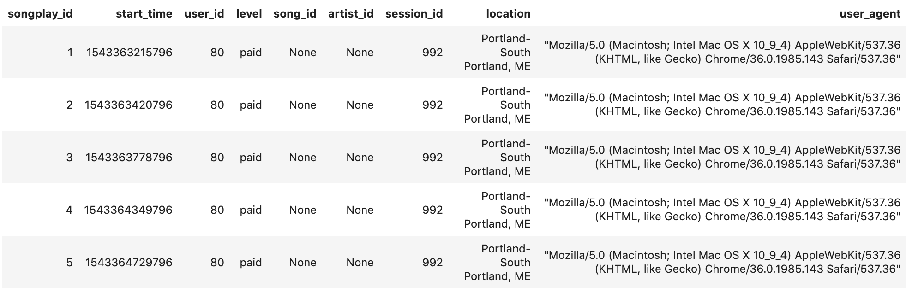
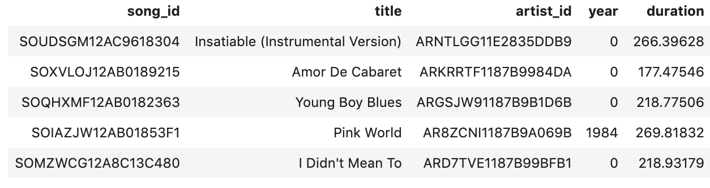
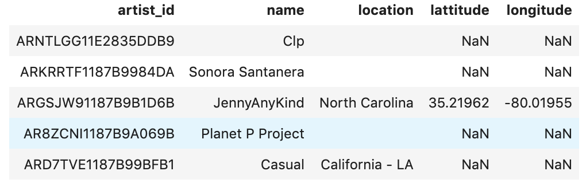
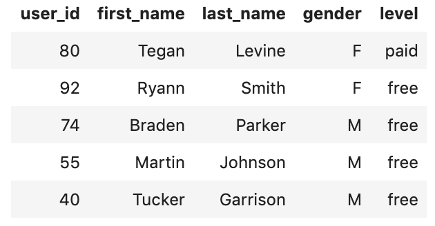
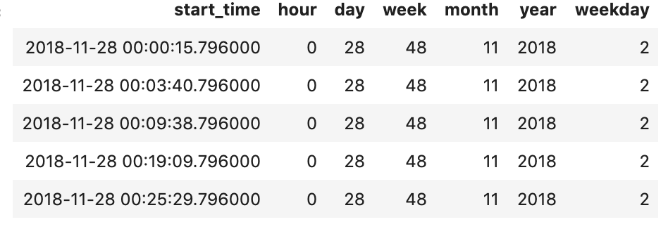

# Udacity Data Engineering Project 1: Data Modelling with PostgreSQL

## Datasets
For this project two databases are used. The first is metadata of songs contained in data / song data. That includes details about a song like who is the producer, how long the song is and details about the person who made it including their name and venue. Such files are stored in JSON format. This is an example:
```json
{"num_songs": 1, "artist_id": "ARJIE2Y1187B994AB7", "artist_latitude": null, "artist_longitude": null, "artist_location": "", "artist_name": "Line Renaud", "song_id": "SOUPIRU12A6D4FA1E1", "title": "Der Kleine Dompfaff", "duration": 152.92036, "year": 0}
```
The other file is data log which is contained in data / log data. These files are stored in JSON format and provide user behavior information for each session within the device. This involves things such as the userAgent that was used to navigate the app, the name, location of the user and what songs they listened to. Inside the program, every log file reflects 1 day of user activity.


### How to run this project:
1. Execute the create_tables.py script to reset the DB or create the DB if it does not exist:
```bash
python create_tables.py
```
2. Execute the etl.py script to perform ETL on the data and load it into the DB:
```bash
python etl.py
```
3. Open and Execute the test.ipynb notebook to ensure the data was loaded correctly


## Schema Design
The model is set up as a star schema that acts as the fact table with user activity linked to the album. This is because the primary objective was to refine song-related queries since that is what the analytics team is primarily interested in. The analytics team right now notices that they waste a lot of time searching through the app interaction logs when they are processed as JSON and need more 

The architecture of this star schema minimizes the amount of joins necessary to query the results. It would make extracting valuable information from the results, and acting on it by extension, much more easily.

There is 1 table of information (song plays), and 4 tables of dimension (users, musicians, albums, time). For fast analytics, the song plays table is connected to dimensional tables which involve more detailed information along a given dimension. The definitions in the table are as follows:

**songplays:** songplay_id, start_time, user_id, level, song_id, artist_id, session_id, location, user_agent
* activity events from the log data that tracks whenever a user plays a song
**users:** user_id, first_name, last_name, gender, level
* detailed user information including what membership they have
**songs:** song_id, title, artist_id, year, duration
* detailed song information
**artists:** artist_id, name, location, lattitude, longitude
* detailed artist information
**time:** start_time, hour, day, week, month, year, weekday
* detailed temporal breakdown regarding song_play time stamps

## ETL Pipeline
The ETL pipeline built extracts metadata from the JSON files and user interaction logs, and constructs the above mentioned star schema. The method will be as follows:
Set up a connection to DB, For all the data, parse the JSON of each song and all the data in the album data archive, and store the data in a list of songs and a list of artists. Parse the JSON of every log file for all data in the log data tab, and separate the details as follows a. Informaton store activity in a song plays facts table b. Keep app info in a users element table c. Keep precise start time details in a time table, (this makes it much easier to scan for different points of interest)   
When the etl script is run it will inform you of how many files were found and the status of processing them.

This was done so that the only thing the analytics team needs to do to ensure the ETL script works is ensure their logs and song metadata get stored in data/log_data and data/song_data respectivley. Since that is the existing structure of this repo, no changes are needed.

The resulting tables should look as follows:

## Song Plays Table


## Songs Table


## Artists Table


## Users Table


## Time Table


